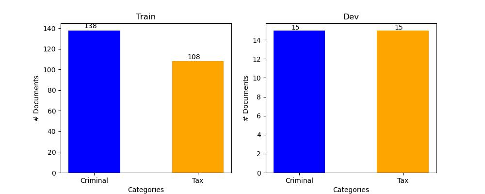
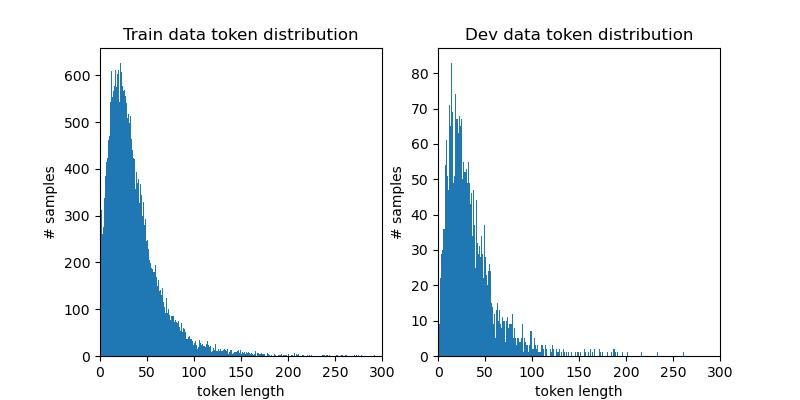
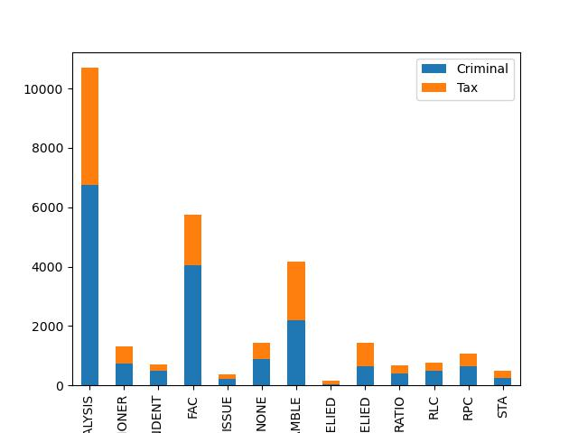
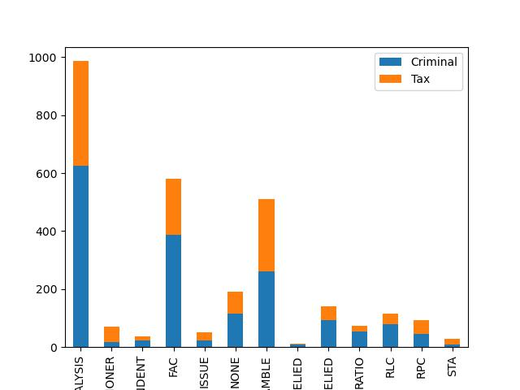

# Rhetorical Roles Prediction (RR) for Indian Legal Documents
This repository contains the codebase for the [Task 6: LegalEval: Understanding Legal Texts (Sub-task A: Rhetorical Roles Prediction (RR))](https://sites.google.com/view/legaleval/home).

## Task Overview
The task of rhetorical roles prediction for Indian legal documents involves automatically identifying the rhetorical roles played by different textual units within a given legal document. In legal documents, rhetorical roles refer to the function or purpose that different textual units serve within the document.

To perform this task, a dataset of annotated legal documents is required, where each textual unit is labeled with its corresponding rhetorical role. The dataset can be used to train a machine learning model, such as a neural network or a decision tree, to predict the rhetorical role of new textual units in unseen legal documents.

The task of rhetorical roles prediction for Indian legal documents is a challenging one due to the complex and nuanced nature of legal language. The model needs to be able to identify the various rhetorical roles played by textual units that can differ in their structure, length, and content. Additionally, legal documents in India can be written in multiple languages, making the task more challenging.

## Dataset
The main goal of the data collection process was to gather information on rhetorical roles at the sentence level in Indian court judgments. Law students from various Indian law universities voluntarily performed the data annotations, classifying each sentence into one of the 13 predefined rhetorical roles as detailed below:

1. ANALYSIS :- It is the parent tag for 3 tags: PRE_RLEIED, PRE_NOT_RELIED and STATUTE.
2. ARG_PETITIONER :- Arguments by petitioners' lawyers
3. ARG_RESPONDENT :- Arguments by respondents lawyers
4. FAC (Facts) :- refers to the chronology of events (but not judgement by lower court) that led to filing the case
5. ISSUE :- Some judgements mention the key points on which the verdict needs to be delivered also known as ISSUES.
6. PREAMBLE :- The preamble of a court case includes the court name, party details, lawyers and judges' names, headnotes, and may also include sections on acts and keywords like "judgment" or "order."
7. PRE_NOT_RELIED :- Discussions and decisions which were not relied upon by the court for final decisions
8. PRE_RELIED :- Discussions and decisions which were relied upon by the court for final decisions.
9. RATIO :- Main Reason given for the application of any legal principle to the legal issue.
10. RLC (Ruling by Lower Court) :- Judgments given by the lower courts
11. RPC (Ruling by Present Court) :- Final decision + conclusion + order of the Court following from the natural / logical outcome of the rationale
12. STA (Statute):- Text in which the court discusses
13. NONE

We have collected the data from the github: https://github.com/Legal-NLP-EkStep/rhetorical-role-baseline

This dataset is broadly divided into train and validation set (test set not provied by the team).

_Train-Dev statistics_
|                       | Train | Train |
|:---------------------:|:-----:|:-----:|
|      # Documents      |  247  |   30  |
|    # Duplicate Docs   |   1   |   0   |
|  # Duplicate Samples  |  150  |   0   |
|    # Unique Samples   | 28836 |  2890 |
|    # Unique Labels    |   13  |   13  |
| sentence length (min) |   1   |   1   |
| sentence length (max) |  695  |  487  |
| sentence length (avg) | 36.98 | 35.48 |

_Category-wise distribution_

_Train-Dev token distribution_

_Train Label distribution_

_Dev Label distribution_

## Models

_ML Models' Experimental Results_
|            |   LR   |       |  SVM  |       |    MLP    |           | XGBoost |       |   RF  |       |
|:----------:|:------:|:-----:|:-----:|:-----:|:---------:|:---------:|:-------:|:-----:|:-----:|:-----:|
|            |  Train |  Dev  | Train |  Dev  |   Train   |    Dev    |  Train  |  Dev  | Train |  Dev  |
|    LB-L    |  0.579 | 0.551 | 0.587 | 0.529 |    0.51   |   0.509   |  0.574  | 0.539 |  0.55 | 0.492 |
|    LB-AE   |  0.488 | 0.375 | 0.511 | 0.376 |   0.365   |   0.327   |  0.455  | 0.368 | 0.489 | 0.361 |
|  LB+ LDA-L |  0.589 | 0.556 | 0.592 | 0.537 |   0.494   |   0.495   |  0.577  |  0.54 | 0.569 | 0.512 |
| LB+ LDA-AE | 0.4947 | 0.377 | 0.511 | 0.375 |   0.385   |   0.342   |  0.458  | 0.374 |  0.48 | 0.359 |
|  LB+ RB-L  |  0.61  | 0.564 | 0.546 | 0.546 | **0.624** | **0.601** |  0.565  | 0.525 | 0.526 | 0.463 |
|  LB+ RB-AE |  0.491 | 0.356 | 0.499 | 0.353 |   0.368   |   0.313   |   0.44  |  0.35 |  0.48 | 0.354 |

_Finetune Results_
|                             |  Dense |       |   Linear  |           |   MBC  |        |
|:---------------------------:|:------:|:-----:|:---------:|:---------:|:------:|--------|
|                             |  Train |  Dev  |   Train   |    Dev    |  Train |   Dev  |
|       LegalBert (CLS)       | 0.5768 |  0.64 |    0.68   |    0.66   |  0.558 | 0.5439 |
|     LegalBert (meanpool)    |  0.389 | 0.361 |   0.718   |   0.6584  | 0.3589 |  0.341 |
|     LegalBert +LDA (CLS)    |  0.367 | 0.341 |   0.664   |   0.655   |  0.447 |  0.404 |
| LegalBert  + LDA (meanpool) |  0.715 | 0.649 |   0.672   |   0.658   | 0.351  | 0.341  |
|     InCaseLawBERT (CLS)     |  0.695 |  0.66 | **0.717** | **0.669** |  0.368 |  0.341 |
|   InCaseLawBERT (meanpool)  |  0.693 | 0.648 |   0.7136  |   0.6557  |  0.356 |  0.333 |

## Contributors
1) Pavan Baswani, MS - IIITH
2) Hiranmai Sri Adibhatla, MS - IIITH